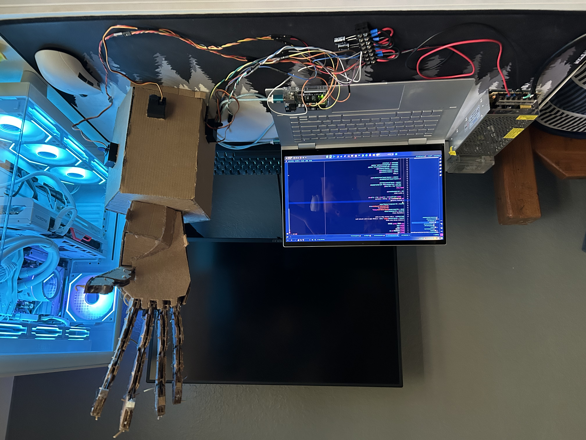
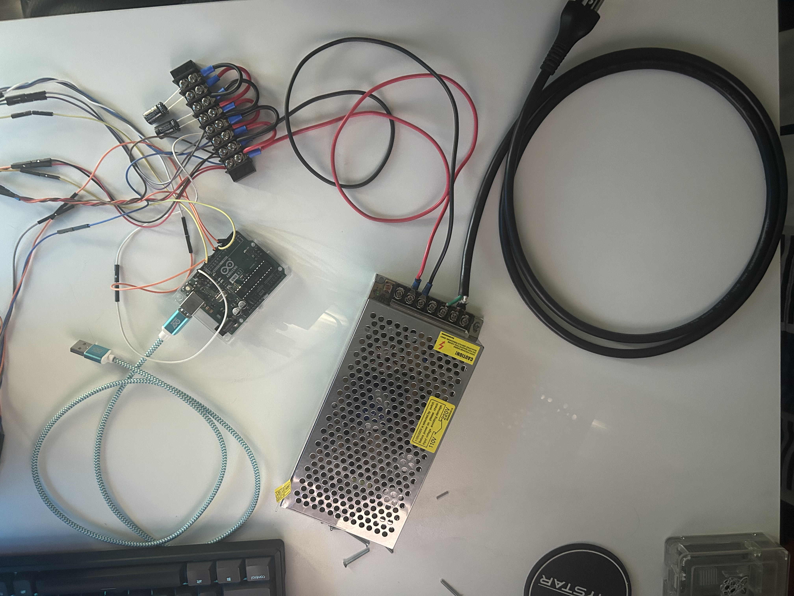
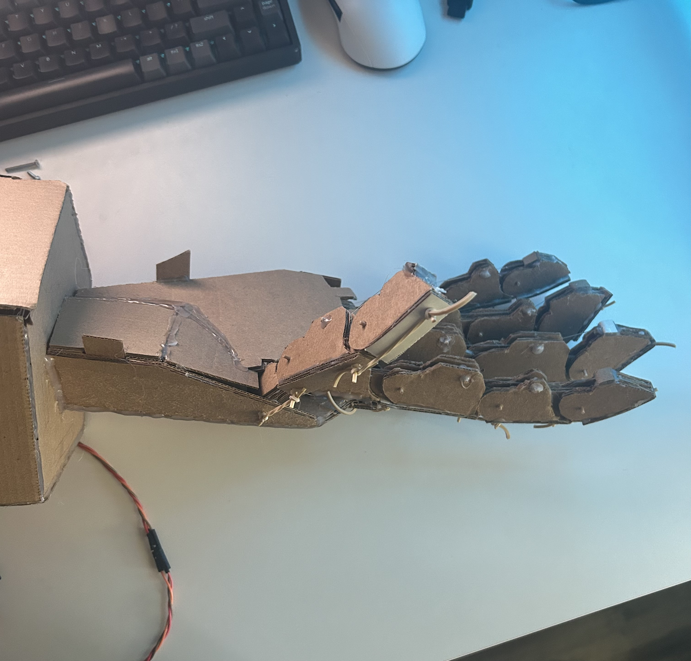
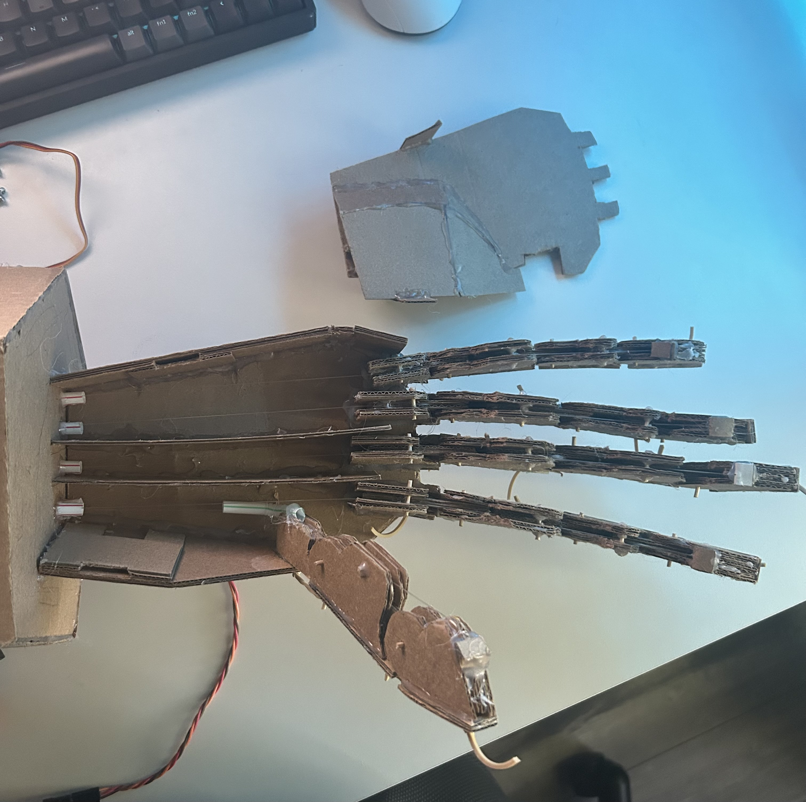
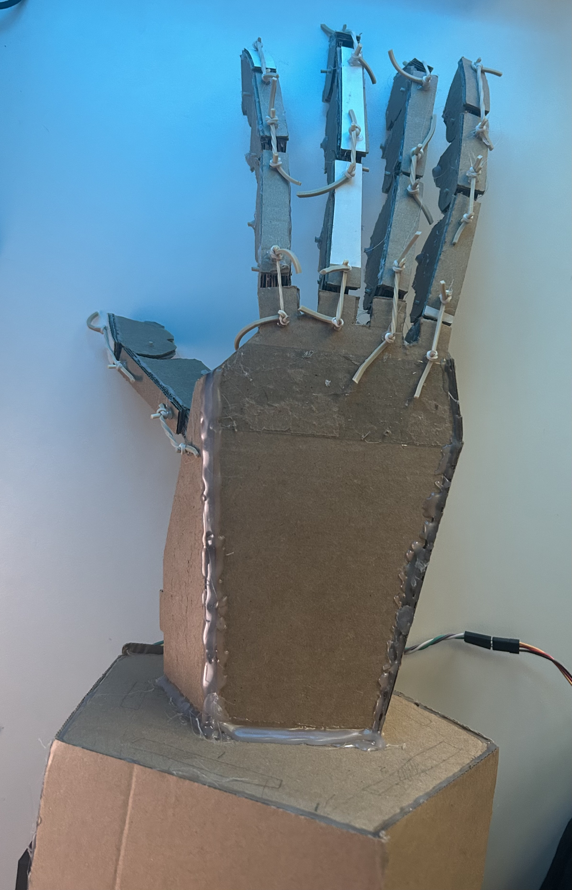
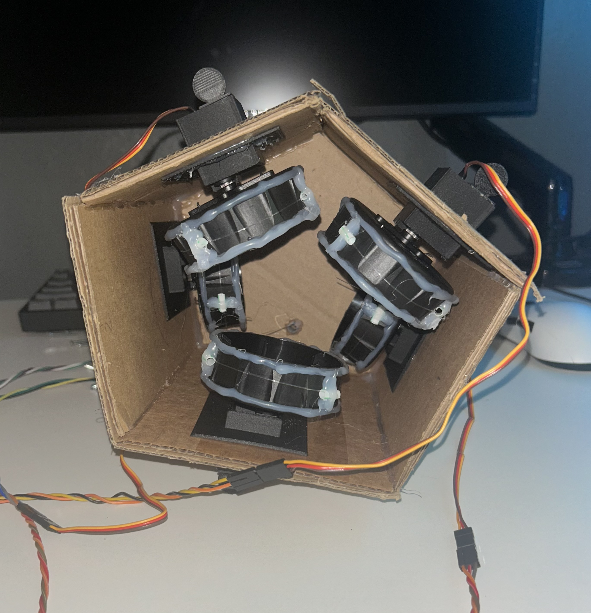
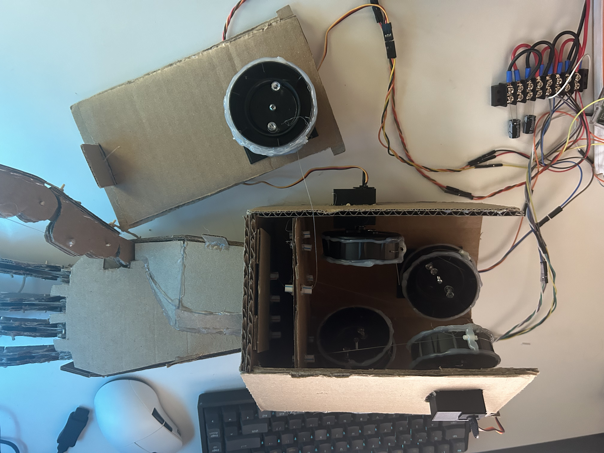
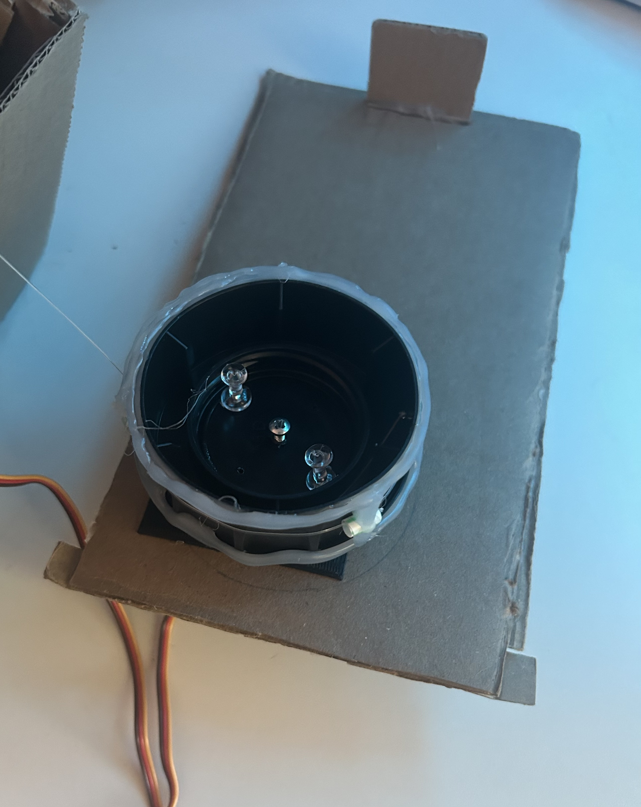
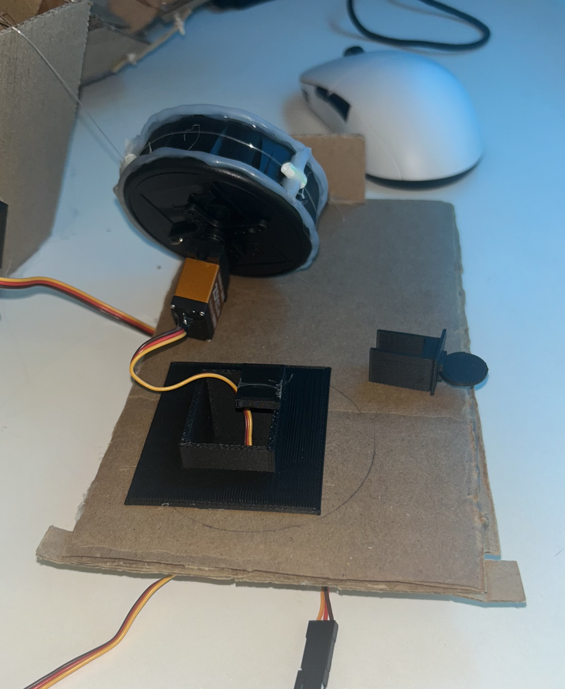
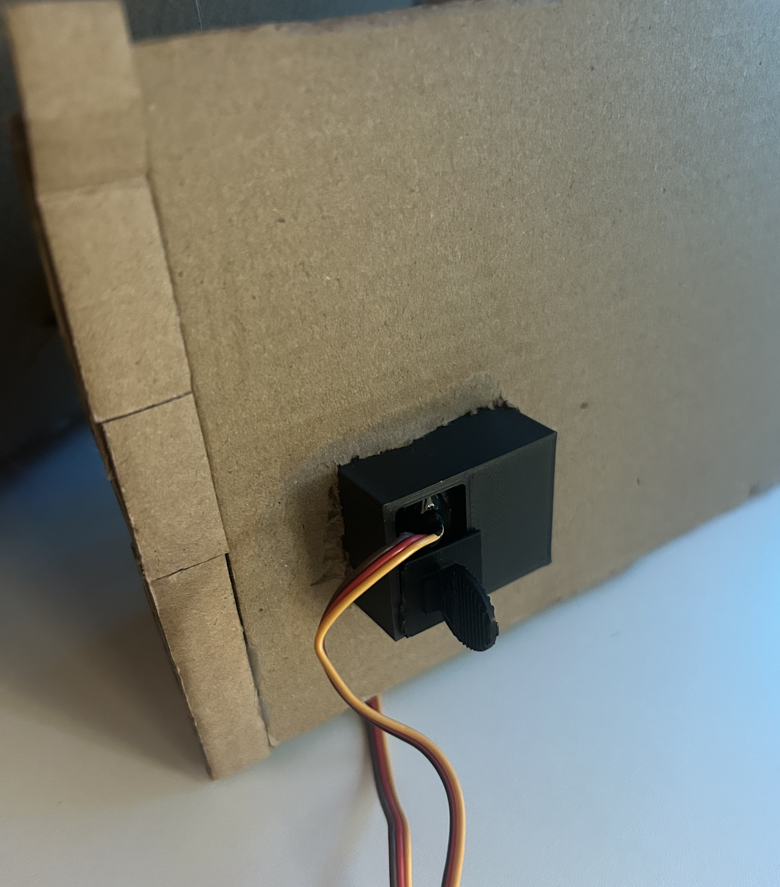

# Robot Hand

## Overview

I originally started this project with the idea of controlling a robot arm by mirroring the movement of my own arm. This was my first hands-on project, so I made many mistakes along the way, which helped me learn a lot. 

The final project uses a laptop camera to track my hand and control five servo motors on a robotic hand. The camera detects my fingers using Python, OpenCV, and MediaPipe. The calculated finger positions are sent to an Arduino through serial communication, which controls the servos.

<p align="center">
  
</p>

## How It Works

The laptop camera captures my hand and sends the frames to the Python program. MediaPipe detects the hand and shows different  points for the fingers and wrist.

For each finger, I calculate the distance between the fingertip and the base of the finger. I then compare that distance to a reference distance near the wrist. This creates a ratio that stays more consistent when my hand moves closer to or farther from the camera.

The ratio is mapped to a servo angle between 0 and 180 degrees. Python then sends the five angles to the Arduino through serial communication.

The Arduino receives the values and moves the five servos to match the movement of my fingers.

## Main Parts

* Arduino Uno Rev 3
* [5 Servo Motors](https://www.amazon.com/gp/product/B0DTPC25YB/ref=ewc_pr_img_2?smid=A2YXT9869S9BVI&psc=1)
* [5V 20A Switching Power Supply](https://www.amazon.com/Aclorol-Switching-Universal-Transformer-Converter/dp/B07KC55TJF/ref=sr_1_1?crid=1VF7RENONPP26&dib=eyJ2IjoiMSJ9.tuHGuJJNRoYOj_HFv1iRYi0jNRctbxJbSRg-LjURn5aDehQGLuq3EldenWFEcg7n7SRVl9JSP7fzVmgXFe8fBxvtCY-fYPBQR2xPLdIvMKMSva_wD_ng-vgeXBOzzjVTbcrVd-yyyPXCk7BzH8-R_Ugv4TGbB7OIT5MyR5btAKDya9xKJOxtGPe7PrDco1OWTZGDtWhP3kSd4KWpbkqGeTrIlOoxkp7erjZHd5e-Cis.WIPIEUcQ3X4tkZ4_3wwwwmTQ3JWl-angvescLwWbu_s&dib_tag=se&keywords=aclorol%2B5v%2B20A%2B100w%2Bswitching%2Bpower%2Bsupply&qid=1790025736&sprefix=aclorol%2B5v%2B20a%2B100w%2Bswitching%2Bpower%2Bsupply%2Caps%2C208&sr=8-1&th=1)
* [Terminal block](https://www.amazon.com/Terminal-Circuits-200v-450v-Terminals-Connectors/dp/B09VSWRQ66/ref=sr_1_1_sspa?crid=359GH7ILMV66&dib=eyJ2IjoiMSJ9.5SATtbt9QfxECTz9DGHXQYSPVgRdu4pd8nZ3yJftB_vTQLS3nnaNjiYfXZ7eY4VjivL_RfqcH20l_xb5LRV8jyNZUBhhM5eCFJ0hXR3hqamTWP-HLuWYIlrsfq_sZsVdNi41wcmNM-wK-2biuTqUeVoVTJTqAhkOf-UePIWoytFJN3JyEV-zfDhkqDcA7UHZvJdnmK5ziXXd4e6fTEpbKaCAjlGYiGg2YNbtZvL7xqc.9URE3NaPZIwnZqvG6P9dF-x3f58l9fxvAvUZ5gdgXfQ&dib_tag=se&keywords=terminal%2Bblock%2C%2B2%2Bpack%2B8%2Bcircuits&qid=1790025378&sprefix=terminal%2Bblock%2C%2B2%2Bpack%2B8%2Bcircuit%2Caps%2C176&sr=8-1-spons&sp_csd=d2lkZ2V0TmFtZT1zcF9hdGY&th=1)
* [Capacitors](https://www.amazon.com/Pieces-1000uf-Capacitor-Aluminum-Electrolytic/dp/B07R432MR2/ref=sr_1_6?crid=3CAHTC20HDGHX&dib=eyJ2IjoiMSJ9.uNhGEAT01ApNfz9MsIr2Z3hg_lbko0W3ZBgtiuXl7zRxmbbfgwqZEWEO-n___np9_lVGQTEhzefU4EIvgEuT6K7sihDoli17IgWZwlgqgO9ZykJCwpOO66QTxVikmcTHqapfLg357rpFpQJ1MmaegoPi7n6dTaJxlPt92-bqv8oC8-BgYhCCxVSwRa2CWOn7c08XlTVHWbPDDl8pT0u6OOrbQ8XVIdx3ZH_OcNrYa0Y.QSeeun8vo0V-GCy59ooTGNiaLDWOGl2dbl_RCOrDJ1A&dib_tag=se&keywords=1000uf+25v+10x17+capacitors&qid=1790025507&sprefix=1000uf+25v+10x17+capacitor%2Caps%2C179&sr=8-6)
* [Fishing wire](https://www.amazon.com/Fishing-Monofilament-Invisible-Decorations-Suitable/dp/B09N72VZGW/ref=sr_1_10?crid=TH1I0062DH4E&dib=eyJ2IjoiMSJ9.lzVKyLhvXA5vg6monWqvHuXZ2dTqpyQsxEz121qhCzYrgaY5S4IRYEiL-acZJKI73mSKByRjkfSJlo4oZ9TcB_J1r8DwknmD0zlRjh4z_XDVY1YzNyoidae3loSVNogggEeJgcq8t8iumWiBp6FUyJGyLeokg-vP7Q8tJhBdxY5YqPKyhmL1yDbDEPSlsVo8OEg2RbUaSoBr8sJznWsQ01pe83k3u0wmztNfIpV0Q3lE8D6htkcUi8J2FYpV8NZEdym3Yxoi6L5RP5GxT-XprxL0EU94izBSDZbG--ZMuAk.FcyYpxNMfYkUSfYrhdXfo_7A8RoOrMQTHunrg2ce4CM&dib_tag=se&keywords=fishing+wire&qid=1790025036&sprefix=fishing+wir%2Caps%2C193&sr=8-10)
* [18 Gauge Wire](https://www.amazon.com/Automotive-Flexible-Security-Stranded-Electrical/dp/B0CKR35SX5/ref=sr_1_7?crid=1H4S5CIMQX6&dib=eyJ2IjoiMSJ9.mSVOIAZW408E424cH9G59NV9EOamEkWAXUSiQ0Jn7ROrP5YnPr6z0jcC71X_EU3focv-yzMWetSqfxBiUElLYdDkdsK7ltFf_Z7XX9pd6lZa_aR_8Kb_EiEMg4DwRzBr7ZewCcStCeM_oyff7FBSKB_nTDpfUVVIc8KxonXH8ot9Mh-QXR1e__tU52dW623kDMOSGCN1ePXZpjsrh_3qw_uFeo1d1T8XyBU-CGXzUjPtMcX2ecVXTAqPGzKONJTTKIbQF7KooNWB4G1BgRNmqY0hjD2wfE2dYXWE_AUsKc8.MAVe1EsIvULBSIX6dIrVCdSe39uqEp-ItQsJcLw_Kmo&dib_tag=se&keywords=18%2Bgauge%2Bwire&qid=1790025586&sprefix=18%2Bgauge%2Bwire%2Caps%2C192&sr=8-7&th=1)
* Power Cord
* Cardboard
* Hot glue
* Rubber Bands
* Laptop webcam
* 3D-printed servo mounts
* Python with OpenCV and MediaPipe

## Starting the Project

I used OpenCV to access the camera on my laptop and MediaPipe to detect my hand.

I first got it to work with one finger. I calculated the distance between the fingertip and the base of the finger, then mapped that distance to a servo angle.

This worked, but there was a major problem. The finger would only move correctly when my hand was at a specific distance from the camera.

I first tried including the Z-axis when calculating the distance, but this did not work. Then I tried adding a reference point near the wrist.

I calculated both the finger distance and the reference distance, then divided them to create a ratio. Since the reference distance changes with the size of the hand in the camera, the ratio kept the distance constant as the hand moves around.

## Power Problems

Once I started controlling multiple servos, I found a problem. The Arduino by itself could not provide enough current for more than two motors at the same time.

To be safe, I switched to a 5V 20A switching power supply, but it would also be fine with 15A. I also needed a terminal block and capacitors to make the wiring easier to manage and keep up wth power spikes.

Here is how I wired my whole project:
Cut the end of the power cord(without prongs) and connect it to the power supply. 
Connect the power supply to the terminal block so that everything is in series.
Connect each motor to a positive and negative section on the terminal block and connect the signal wire directly to the Arduino. 
Just remember which motor each pin is connected to so it matches the Arduino code(ex: If the thumb motor is connected to pin 5, then attach the corresponding servo to pin 5)
Connect the ground pin on the Arduino to a ground section on the terminal block
I also added 2 capacitors to the setup to handle any power spikes when operating

<p align="center">
  
</p>

## Building the Hand

I built the hand using cardboard and hot glue. I used this [YouTube video](https://www.youtube.com/watch?v=GTH_Tzg1DmA&t=174s) to make the fingers, but I needed to change the palm and forearm to accommodate the motors.

I made the top of the palm detachable so I could easily add the wire or change anything if needed. I also made the wrist into a pentagon shape so each side could hold a motor, with one side being detachable to easily work on the motors.

<p align="center">
   
  
</p>

<p align="center">
  
  
</p>

<p align="center">
  
</p>

## Solving the Servo Problems

The first problem with the servo motors was that the arms were too short to pull the fingers far enough.

At the time, I did not have a 3D printer, so I had to get creative and used a large bottle cap. I attached the bottle cap to the servo arm and used it as a larger spool for the fishing line. I also added hot glue around the cap to keep the line from slipping off.

This gave the servo enough pulling distance to fully curl the fingers.

<p align="center">
  
</p>


I then added rubber bands to pull the fingers back into an open position. This created another problem because the original servos were not strong enough to pull against the rubber bands.

I eventually replaced them with stronger 5V servos that were about three times as strong. The new servos were strong enough to curl the fingers, but they kept pulling themselves out of the hole in the cardboard.

By this point, I had a 3D printer, so I designed and printed custom servo mounts. The mounts held the servos in place while still making it easy to add or remove the motors.

<p align="center">
  
  
</p>

Here are the [STL files](MotorMountObjects) for the motor mounts

## Final Result

The final hand can track all five fingers using a laptop camera and move the corresponding servos in real time.

The hand is built mostly from cardboard, with a couple of 3D-printed parts for the motor mounts. Some parts are detachable, which allows you to work on any part without having to disassemble anything.

https://github.com/user-attachments/assets/ec4b08c5-9e10-4184-8056-761c9ff1205a

## What I Learned

While this project presented a lot of new challenges to overcome, it has inspired me to want to work on other projects in the future. I had to learn about power supplies, wiring, servos, mechanical designs, Arduino programming, computer vision, and CAD.

One of the biggest things I learned was that the initial plan can change a lot. I actually started with EMG sensors, but the setup became too complicated and expensive, so I changed the project to use computer vision. I also had to redesign parts many times when the motors, power system, or cardboard structure did not work as expected.

I learned that mechanical problems can make or break the entire project. A small change like using a bottle cap as a spool on the motor allowed the fingers to curl all the way.

Most of the project was built by testing an idea, checking if it would work with the other parts, and changing the design until it worked. This process taught me more than simply following a project tutorial from beginning to end.

## Future Improvements

While the project works as I expected, there are still a few things I would like to improve:

* 3D print the fingers to reduce friction between the moving parts
* Make the detachable forearm section more stable
* 3D print the spool to make it lighter and be 1 single piece
* Make the thumb curl as fast as the other fingers

## Software

The Python program uses:

* OpenCV
* MediaPipe
* NumPy
* PySerial

## How to Set Up and Run the Program

### 1. Clone the Repository 

* Click on the green "Code" button at the top right and copy the URL
* Open PyCharm and go to File -> Project from Version Control
* Make sure you are in the Repository URL section
* Then paste the URL into the box next to "URL"
* Choose where you want to save it and click "Clone"

### 2. Download Python
* Make sure that you have Python installed on your computer
* You can check by going to the bottom left and clicking on the terminal button
* Then type:
  ```
  python --version
  ```
* into the terminal, and you should get a version number
* If not, you can download it from python.org

### 3. Create a Virtual Environment

* In PyCharm, go to:
* File -> settings -> Project -> Python Interpreter
* Click "Add Interpreter" and select "Add Local Interpreter"
* Choose Virtualenv for the type
* For Base Python, choose Python 3.9.13
* If it is not available, install Python 3.9.13 separately and select it as the Base Python
* Click "Apply" and "Ok"
* Open the PyCharm terminal and check that there is "(.venv)" at the beginning of the line
* (You might need to open a new terminal)

### 4. Install Libraries
* Using the terminal, go to the Python folder(make sure you see "(.venv)" at the beginning of the line):
```
cd python
```
* Then install the required libraries:
```
python -m pip install -r requirements.txt
```


### 5. Connect the Arduino

* Download the IDE from [here](https://docs.arduino.cc/software/ide/?_gl=1*1955iv4*_up*MQ..*_ga*MTE0NzkzODk2MC4xNzkwMTQwMzU2*_ga_NEXN8H46L5*czE3OTAxNDAzNTUkbzEkZzAkdDE3OTAxNDAzNTUkajYwJGwwJGg2NDk4NjA1MTM.)
* Open the arduino/handMotors.ino file or copy and paste the code into a new file
* Connect the Arduino to your computer with a USB cable
* Select the correct Arduino board and COM port in the drop-down list in the top left
* Upload the code to the Arduino by clicking on the right arrow button in the top left

### 6. Check Serial Port

* In the Arduino IDE, go to Tools -> Port
* and check what port is being used (ex: "COM3")
* If it does not match the code, update the line to match your COM port
```python
arduino = serial.Serial('COM3', 9600)
```

### 7. Run Program

* Make sure the Arduino is still connected to your computer
* Click on the green arrow at the top right to run the program
* The camera should open and track your hand

### Troubleshooting

* If the camera does not open:
* Make sure another application is not already using your camera
* If it does not recognize "solution", make sure mediapipe version 0.10.x is installed by running:
```
python -c "import mediapipe as mp; print(mp.__version__)"
```
* If you have a different version, run: 
```
python -m pip uninstall mediapipe
```
* and confirm it. Then run:
```
python -m pip install mediapipe==0.10.21
```
* The software can be tested without the hand or motors being connected
* Only an Arduino is required to be connected
